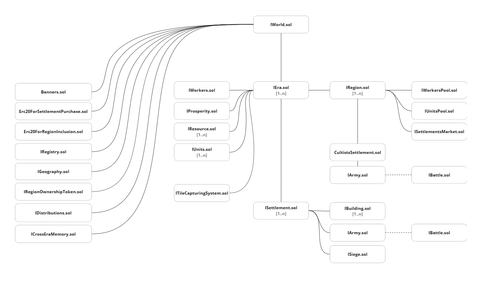

# Mithraeum API Docs

## Game structure

Scheme above roughly represents how smart contracts placed in the system.

## Brief explanation of each element

### World.sol

Contains references to standalone contracts (initialized once when world is deployed) as well as produced eras during gameplay.

### Registry.sol

Contains game configuration constants related to game balance.

### Geography.sol

Contains geography information.

### Banners.sol

Standalone ERC721 & ERC1155Receiver. Used to link settlement with Nft.

### Distributions.sol

Standalone ERC1155. Specifies distribution rules. Each building has own distribution rules.

### CrossErasMemory.sol

Contains saved necessary data in between era destruction's.

### RewardPool.sol

Contains Erc20 tokens which can be swapped for ingots.

### Era.sol

Contains addresses which represent current game tokens such as resources, units, workers, prosperity; Also contains placed settlements and activated regions in current era.

### Resource.sol

Custom ERC-20 token, interacts with world when transfer happens related to world assets and gives the world an ability to modify balances whenever necessary (in such events as productions, robbery, interacting with workers or units markets, etc.). Represents FOOD, WOOD, ORE, INGOT tokens.

### Workers.sol

Custom ERC-20 token, only certain world asset able to have this token, such as 'Settlement', 'Building', 'WorkersPool'. Interacts with world when transfer happens related to world assets and gives the world an ability to modify balances whenever necessary (in such events as set from/to production building, interacting with workers pools, etc.).

### Units.sol

Custom ERC-20 token, only certain world asset able to have this token, such as 'Siege', 'Army', 'UnitsPool'. Interacts with world when transfer happens related to world assets and gives the world an ability to modify balances whenever necessary (in such events as minting occultists, interacting with units pools, etc.).

### Prosperity.sol

Custom ERC-20 token, only certain world asset able to have this token, such as 'Settlement', 'WorkersPool'. Gives the world an ability to modify balances whenever necessary (in such events as replenishing treasury, interacting with workers pools, etc.). Even though this is ERC-20 token real balance of it can be negative.

### Settlement.sol

Central hub of user assets. Banner id specified in this contract will be considered as settlement owner. Contains settlements' assets, such as buildings, siege, army. Also methods to manage governors and settlement.

### Region.sol

Contains settlement market, addresses to related workers and units pools and parameters which are related to these pools. Also contains method to spawn cultists.

### CultistsSettlement.sol

Modified settlement entity, which doesn't have an owner. Main purpose of it is containing the army of occultists in each zone.

### Army.sol

Contains data about current position, siege, battle, movement and method to manage/interact with current army.

### SettlementMarket.sol

Settlement market related to its zone. Contains parameters and method to provide settlement market capabilities. Bless token is the currency you use in this market.

### WorkersPool.sol

Workers pool which related to its zone. Contains parameters and method to provide workers pool capabilities. Settlement's prosperity is the currency you use in this pool.

### UnitsPool.sol

Units pool which related to its zone. Contains parameters and method to provide units pool capabilities. Ingot is the currency you use in this pool.

### Building.sol

Abstract entity of production building which contains common production state and logic related to production. Every production building inherits this element.

### Siege.sol

Contains data about current siege, besieging armies. Also contains method to manage siege, such as stake/unstake units, building robbery, army liquidation, etc.

### Battle.sol

Contains data about current battle, joined armies. Also contains methods to interact with battle, such as joining, finishing battle, exiting from battle.
